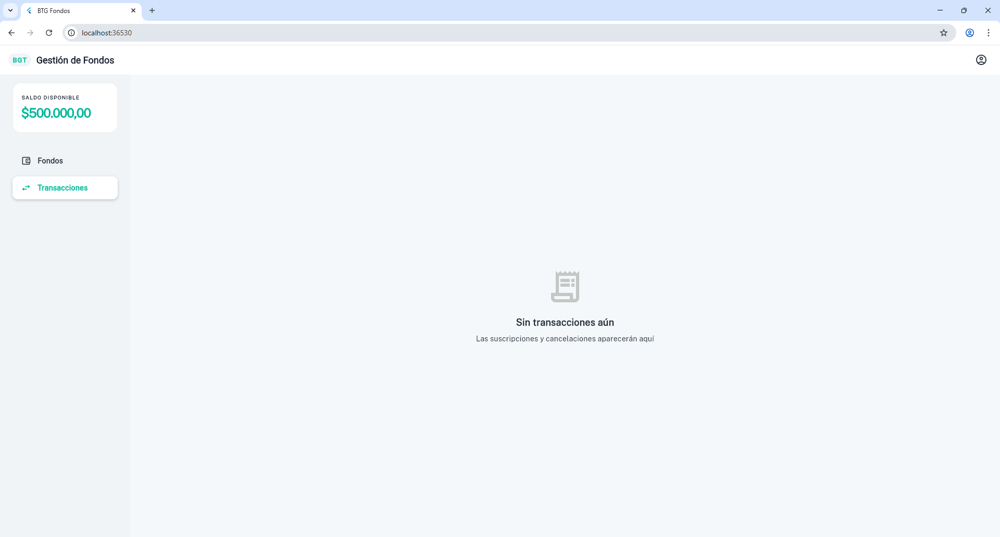
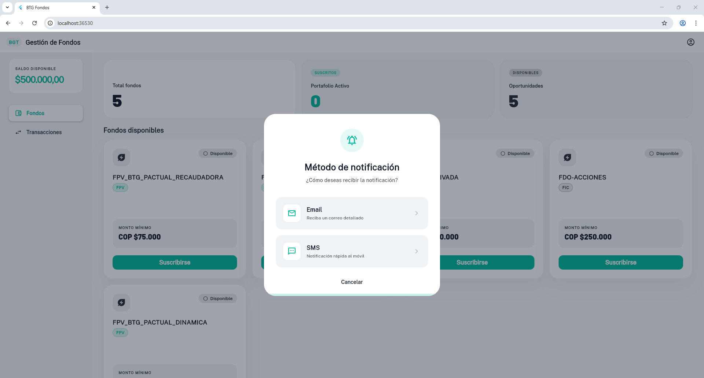
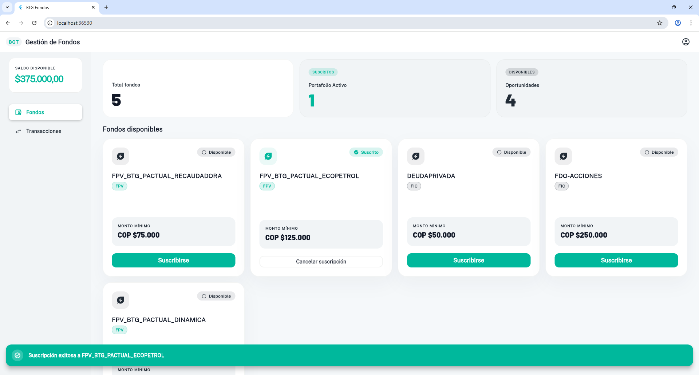
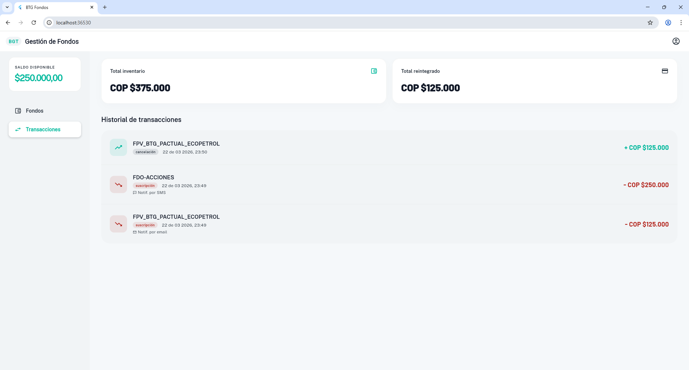

# BTG Fondos — Prueba Técnica Frontend

Aplicación web interactiva para gestión de Fondos FPV/FIC de BTG Pactual.

## Capturas de pantalla

### Desktop






##  Stack tecnológico
- **Flutter 3.x** — Web
- **Riverpod 2** — Manejo de estado
- **Clean Architecture** — Domain / Data / Presentation
- **Atomic Design** — Atoms / Molecules / Organisms / Pages
- **SOLID Principles** + Clean Code

## Dependencias

| Librería | Versión | Descripción |
|---|---|---|
| `flutter_riverpod` | ^3.3.1 | Manejo de estado reactivo. Gestiona el estado global de la cuenta del usuario (saldo, fondos suscritos, transacciones) y la carga asíncrona de fondos mediante providers declarativos |
| `google_fonts` | ^8.0.2 | Acceso a fuentes tipográficas de Google. Provee las fuentes **Public Sans** (textos de interfaz) y **Barlow** (valores numéricos y montos) usadas en el sistema de diseño |
| `intl` | ^0.20.2 | Internacionalización y formateo. Formatea montos en pesos colombianos (COP $500.000) y fechas en español colombiano (22 de mar 2026, 14:30) |
| `uuid` | ^4.5.3 | Generación de identificadores únicos (UUID v4) para cada transacción creada al suscribirse o cancelar un fondo |
| `equatable` | ^2.0.8 | Comparación de objetos por valor en lugar de por referencia. Permite a Riverpod detectar cambios de estado reales y evitar re-renders innecesarios |

##  Requisitos previos
- Flutter SDK >= 3.0.0
- Chrome instalado
- VS Code con extensiones Flutter y Dart

##  Instalación y ejecución

### 1. Clonar el repositorio
git clone https://github.com/JoseAlvrez/btg_fondos.git
cd btg_fondos

### 2. Instalar dependencias
flutter pub get

### 3. Ejecutar en Chrome
flutter run -d chrome

##  Funcionalidades
1. Listado de fondos disponibles con diseño responsivo
2. Suscripción con validación de saldo mínimo
3. Selección de método de notificación (Email / SMS)
4. Cancelación con reintegro automático del saldo
5. Historial completo de transacciones
6. Mensajes de error cuando no hay saldo suficiente
7. Diseño responsivo Mobile / Tablet / Desktop

## Arquitectura
```
lib/
├── core/                          # Configuración global
│   ├── constants/                 # Constantes de la app (saldo inicial, etc.)
│   ├── theme/                     # Colores y tema Material 3
│   ├── utils/                     # Utilidades (ResponsiveUtils, breakpoints)
│   └── widgets/                   # Widgets globales reutilizables (AppText)
│
├── domain/                        # Capa de negocio pura — sin dependencias Flutter
│   ├── entities/                  # Entidades: FundEntity, TransactionEntity
│   ├── enums/                     # Enumeraciones: FundCategory, NotificationMethod
│   ├── exceptions/                # Excepciones de negocio: InsufficientBalanceException
│   ├── repositories/              # Contratos abstractos (interfaces)
│   └── usecases/                  # Casos de uso: GetFunds, SubscribeFund, CancelFund
│       ├── params/                # Parámetros de entrada de los casos de uso
│       └── results/               # Resultados de salida de los casos de uso
│
├── data/                          # Implementación de datos (mock API REST)
│   ├── datasources/               # Fuente local que simula llamadas HTTP
│   ├── models/                    # Modelos con serialización JSON
│   └── repositories/              # Implementaciones concretas de los repositorios
│
├── presentation/                  # Capa de UI — Atomic Design
│   ├── atoms/                     # Unidades mínimas: BtgButton, BtgCategoryBadge
│   ├── molecules/                 # Combinación de átomos: BtgFundCard, BtgTransactionItem
│   ├── organisms/                 # Secciones complejas: BtgSidebar, BtgFundsTab
│   ├── pages/                     # Pantalla principal: HomePage
│   ├── providers/                 # Providers Riverpod: fundsProvider, userAccountProvider
│   ├── notifiers/                 # StateNotifiers: UserAccountNotifier
│   ├── state/                     # Estados inmutables: UserAccountState
│   └── utils/                     # Utilidades de UI: SnackbarUtils, FundUiMapper
│
└── main.dart                      # Entry point — ProviderScope + MaterialApp
```

- **Domain**: Entidades, repositorios abstractos, casos de uso
- **Data**: Modelos, datasource mock, repositorios implementados
- **Presentation**: Providers Riverpod, Atomic Design

## Patrones aplicados

- **Clean Architecture** — Separación estricta en capas Domain / Data / Presentation
- **SOLID Principles** — Cada clase tiene una sola responsabilidad, depende de abstracciones
- **Atomic Design** — Atoms → Molecules → Organisms → Pages
- **Clean Code** — Código legible, comentado y sin duplicación
- **Repository Pattern** — Abstracción de la fuente de datos
- **Use Cases** — Lógica de negocio encapsulada e independiente de la UI
