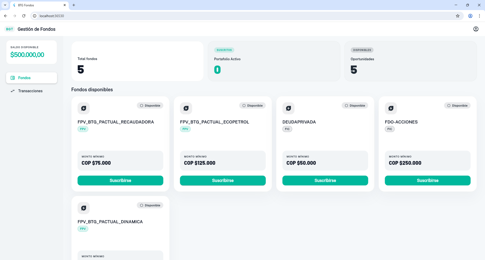

# BTG Fondos — Prueba Técnica Frontend

Aplicación web interactiva para gestión de Fondos FPV/FIC de BTG Pactual.

## 📸 Capturas de pantalla

### Desktop

##  Stack tecnológico
- **Flutter 3.x** — Web
- **Riverpod 2** — Manejo de estado
- **Clean Architecture** — Domain / Data / Presentation
- **Atomic Design** — Atoms / Molecules / Organisms / Pages
- **SOLID Principles** + Clean Code

##  Requisitos previos
- Flutter SDK >= 3.0.0
- Chrome instalado
- VS Code con extensiones Flutter y Dart

##  Instalación y ejecución

### 1. Clonar el repositorio
git clone https://github.com/TU_USUARIO/btg_fondos.git
cd btg_fondos

### 2. Instalar dependencias
flutter pub get

### 3. Ejecutar en Chrome
flutter run -d chrome

##  Funcionalidades
1. Listado de fondos disponibles con diseño responsivo
2. Suscripción con validación de saldo mínimo
3. Selección de método de notificación (Email / SMS)
4. Cancelación con reintegro automático del saldo
5. Historial completo de transacciones
6. Mensajes de error cuando no hay saldo suficiente
7. Diseño responsivo Mobile / Tablet / Desktop

## 🏗️ Arquitectura
Domain → Data → Presentation

- **Domain**: Entidades, repositorios abstractos, casos de uso
- **Data**: Modelos, datasource mock, repositorios implementados
- **Presentation**: Providers Riverpod, Atomic Design

##  Patrones aplicados
- Clean Architecture
- SOLID Principles
- Atomic Design
- Clean Code
- Repository Pattern
- Use Cases
